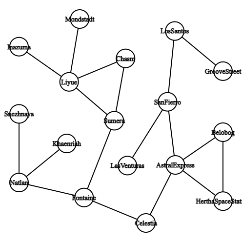

# Final Project Struktur Data - Graph Game

| Nama | NRP |
| ----------- | ----------- |
| Muhammad Harvian Dito | 5027221039 |
| Awang Fraditya | 5027221055 |
| Sighra Attariq | 5027221068 |

# Masinis

**Masinis** adalah game Turn-Based RPG yang berbasis Graph dan terinspirasi dari game Turn-Based RPG lainnya seperti *Epic Seven* dan *Persona*. **Masinis** berjalan secara CLI dan ditulis dengan C++.

## Graph Movement

Movement karakter di game ini berbasis graph statis. Karakter dapat berpindah tempat sesuai dengan graph yang terkoneksi. Tempat yang bisa dikunjungi karakter akan terdisplay di CLI. Tidak semua tempat memiliki musuh, dan variasi musuh berbeda - beda di setiap tempat. Jika karakter mencapai tujuan akhir maka player menang.

## Turn-Based Game

Turn-Based Game adalah game dimana pemain bergantian untuk melakukan suatu langkah atau tindakan. Contoh dari Turn-Based game adalah Catur, Ludo, permainan kartu, RPG atau game lainnya.

Pemain bisa mengatur taktik untuk mengalahkan musuh, sehingga game ini bisa menjadi game strategi.

Pada game **Masinis**, Turn-Based digunakan pada saat Karakter yang dimainkan bertemu dengan musuh di suatu tempat.

Untuk menentukan siapa yang akan mulai duluan akan ditentukan dengan membandingkan *speed* karakter dan musuh. Pemain dapat memilih skill yang ingin digunakan dan musuh hanya dapat menggunakan default skill. Jika karakter mati maka game akan selesai.

# Class

## Character

Class Character adalah Abstract Class yang harus diinisialisasikan oleh Subclassnya. Class ini menggunakan prinsip Encapsulation, Inheritance, Polymorphism, dan Abstraction. Class ini menyimpan attribut karakter.

### Attributes

| Role | Health | Attack Power | Magic Power | Speed |
| ----------- | ----------- | ----------- | ----------- | ----------- | 
| Mage | 90 | 5 | 20 | 20 |
| Sniper | 95 | 22 | 13 | 17 |
| Rogue | 75 | 27 | 12 | 25 |


### Skill Multiplier

| Role | Basic | Skill | Ultimate | 
| ----------- | ----------- | ----------- | ----------- | 
| Mage | 1 * AP | 1.3 * MP | 2 * MP |
| Sniper | 1 * AP | 1.3 AP | 2 * AP | 
| Rogue | 1 * AP | 1.3 * AP | 1.5 * AP + 0.5 * MP | 

```cpp
class Character {
     private:
        int level;
        int expCap;
        int exp;
        string name;
        float maxHealth;
        float currentHealth;
        float magicPower;
        float attackPower;
        float current_location;
        float speed;

    public:
        string basicName;
        int skillCooldown;
        string skillName;
        int ultimateCooldown;
        string ultimateName;

        Character(const string& name, float health, float ap, float mp, float speed, string basic, string skill, string ultimate) : name(name), maxHealth(health), currentHealth(health), attackPower(ap), magicPower(mp), speed(speed), 
        basicName(basic), skillName(skill), ultimateName(ultimate), current_location(0), exp(0), level(1), expCap(20), skillCooldown(0), ultimateCooldown(0) {}

        virtual ~Character() {}

        virtual void attack(NPC &enemy) = 0;

        virtual void addAttributes(int level) = 0;

        void move(int new_location) {
            current_location = new_location;
        }

        int getLocation() {
            return current_location;
        }

        int getLevel() {
            return level;
        }

        float getMaxHealth() {
            return maxHealth;
        }

        float getCurrentHealth() {
            return currentHealth;
        }

        float getSpeed() {
            return speed;
        }

        float getMagicPower() {
            return magicPower;
        }

        float getAttackPower() {
            return attackPower;
        }

        void setCurrentHealth(float hp) {
            currentHealth = hp;
        }

        void setMaxHealth(float hp) {
            maxHealth = hp;
        }

        void setAttackPower(float ap) {
            attackPower = ap;
        }

        void setMagicPower(float mp) {
            magicPower = mp;
        }

        void setSpeed(float sp) {
            speed = sp;
        }

        bool isAlive() {
            return currentHealth > 0;
        }

        string getName() {
            return name;
        }

        void setEXP(int e) {
            exp += e;
        }

        void checkEXP() {
            int prevLevel = level;
            while(true) {
                if (exp >= expCap) {
                    level += 1;
                    exp = exp - expCap;
                    expCap += 20;
                } else {
                    break;
                }
            }
            cout << name << " has leveled up to level " << level << endl;

            if (prevLevel != level) {
                addAttributes(level - prevLevel);
            } 
        }
};
```

### Mage - Character Subclass

Class Mage adalah Subclass dari Character. Class ini akan menginisialisasikan Atrribut Mage serta menyimpan cara menyerang dan multiplier Mage.

```cpp
class Mage : public Character {
    public:

        Mage(const string& name) : Character(name, 90, 5, 20, 20, "Bonk!", "Slapur Slaps!", "Kuchiyose: Mahoraga") {}

        void attack(NPC& enemy) override {
            bool skillOnCooldown = (skillCooldown > 0);
            bool ultimateOnCooldown = (ultimateCooldown > 0);

            cout << "Attack Ability:\n1. "<< basicName << "\n2. " << skillName;
            if (skillOnCooldown) {
                cout << "(" << skillCooldown << ")";
            }
            cout << "\n3. " << ultimateName;
            if (ultimateOnCooldown) {
                cout << "(" << ultimateCooldown << ")";
            }

            int skill;
            while (true) {
                cout << "\nChoose Ability (1/2/3): ";
                cin >> skill;

                if (skill == 1) {
                    float damage = getAttackPower();
                    enemy.setHealth(enemy.getHealth() - damage);
                    cout << "\n" << getName() << " deals " << damage << " damage to " << enemy.getName() << " with " << basicName << endl;
                    break;
                } else if (skill == 2) {
                    if (skillOnCooldown) {
                        cout << "The ability is still in cooldown, choose another ability." << endl;
                        continue;
                    } else {
                        float damage = getMagicPower() * (1 + 0.3);
                        enemy.setHealth(enemy.getHealth() - damage);
                        cout << "\n" << getName() << " deals " << damage << " damage to " << enemy.getName() << " with " << skillName << endl;
                        skillCooldown = 2;
                    }
                    break;
                } else if (skill == 3) {
                    if (ultimateOnCooldown) {
                        cout << "The ability is still in cooldown, choose another ability." << endl;
                        continue;
                    } else {
                        float damage = getMagicPower() * (1 + 1);
                        enemy.setHealth(enemy.getHealth() - damage);
                        cout << getName() << " deals " << damage << " to " << enemy.getName() << " with " << ultimateName << endl;
                        ultimateCooldown = 4;
                    }
                    break;
                } else {
                    cout << "Invalid choice. Please choose 1, 2, or 3." << endl;
                }
            }

            if (skillOnCooldown) {
                skillCooldown--;
            }
            if (ultimateOnCooldown) {
                ultimateCooldown--;
            }
        }

        void addAttributes(int level) {
            setMaxHealth(getMaxHealth() + level * 7);
            setCurrentHealth(getMaxHealth());
            setAttackPower(getAttackPower() + level * 0.3);
            setMagicPower(getMagicPower() + level * 4);
            setSpeed(getSpeed() + level * 2);
        }
};
```

### Sniper - Character Subclass

Class Sniper adalah Subclass dari Character. Class ini akan menginisialisasikan Attribut Sniper serta menyimpan cara menyerang dan multiplier Sniper.

```cpp
class Sniper : public Character {
    public:
        Sniper(const string& n) : Character(n, 95, 22, 13, 17, "Dor!", "Showstopper", "Satanael: Sinfull Shell") {}

        void attack(NPC& enemy) override {
            bool skillOnCooldown = (skillCooldown > 0);
            bool ultimateOnCooldown = (ultimateCooldown > 0);

            cout << "Attack Ability:\n1. " << basicName << "\n2. " << skillName;
            if (skillOnCooldown) {
                cout << "(" << skillCooldown << ")";
            }
            cout << "\n3. " << ultimateName;
            if (ultimateOnCooldown) {
                cout << "(" << ultimateCooldown << ")";
            }

            int skill;
            while (true) {
                cout << "\nChoose Ability (1/2/3): ";
                cin >> skill;

                if (skill == 1) {
                    float damage = getAttackPower();
                    enemy.setHealth(enemy.getHealth() - damage);
                    cout << "\n" << getName() << " deals " << damage << " damage to " << enemy.getName() << " with " << basicName << endl;
                    break;
                } else if (skill == 2) {
                    if (skillOnCooldown) {
                        cout << "The ability is still in cooldown, choose another ability." << endl;
                        continue;
                    } else {
                        float damage = getAttackPower() * (1);
                        enemy.setHealth(enemy.getHealth() - damage);
                        cout << "\n" << getName() << " deals " << damage << " damage to " << enemy.getName() << " with " << skillName << endl;
                        skillCooldown = 2;
                    }
                    break;
                } else if (skill == 3) {
                    if (ultimateOnCooldown) {
                        cout << "The ability is still in cooldown, choose another ability." << endl;
                        continue;
                    } else {
                        float damage = getAttackPower() * (1 + 1) + getMagicPower() * (0.12);
                        enemy.setHealth(enemy.getHealth() - damage);
                        cout << getName() << " deals " << damage << " to " << enemy.getName() << " with " << ultimateName << endl;
                        ultimateCooldown = 4;
                    }
                    break;
                } else {
                    cout << "Invalid choice. Please choose 1, 2, or 3." << endl;
                }
            }

            if (skillOnCooldown) {
                skillCooldown--;
            }
            if (ultimateOnCooldown) {
                ultimateCooldown--;
            }
        }

        void addAttributes(int level) {
            setMaxHealth(getMaxHealth() + level * 6);
            setCurrentHealth(getMaxHealth());
            setAttackPower(getAttackPower() + level * 3);
            setMagicPower(getMagicPower() + level * 1);
            setSpeed(getSpeed() + level * 1);
        }
};
```

### Rogue - Character Subclass

Class Rogue adalah Subclass dari Character. Class ini akan menginisialisasikan Attribut Rogue serta menyimpan cara menyerang dan multiplier Rogue.

```cpp
class Rogue : public Character {
    public:
        Rogue(const string& n) : Character(n, 75, 27, 12, 25, "Steal", "Hassou Tobi", "Storm that is Approaching") {}

        void attack(NPC& enemy) override {
            bool skillOnCooldown = (skillCooldown > 0);
            bool ultimateOnCooldown = (ultimateCooldown > 0);

            cout << "Attack Ability:\n1. " << basicName << "\n2. " << skillName;
            if (skillOnCooldown) {
                cout << "(" << skillCooldown << ")";
            }
            cout << "\n3. " << ultimateName;
            if (ultimateOnCooldown) {
                cout << "(" << ultimateCooldown << ")";
            }

            int skill;
            while (true) {
                cout << "\nChoose Ability (1/2/3): ";
                cin >> skill;

                if (skill == 1) {
                    float damage = getAttackPower();
                    enemy.setHealth(enemy.getHealth() - damage);
                    cout << "\n" << getName() << " deals " << damage << " damage to " << enemy.getName() << " with " << basicName << endl;
                    break;
                } else if (skill == 2) {
                    if (skillOnCooldown) {
                        cout << "The ability is still in cooldown, choose another ability." << endl;
                        continue;
                    } else {
                        float damage = getAttackPower() * (1 + 0.3);
                        enemy.setHealth(enemy.getHealth() - damage);
                        cout << "\n" << getName() << " deals " << damage << " damage to " << enemy.getName() << " with " << skillName << endl;
                        skillCooldown = 2;
                    }
                    break;
                } else if (skill == 3) {
                    if (ultimateOnCooldown) {
                        cout << "The ability is still in cooldown, choose another ability." << endl;
                        continue;
                    } else {
                        float damage = getAttackPower() * (1 + 0.5) + getMagicPower() * (0.5);
                        enemy.setHealth(enemy.getHealth() - damage);
                        cout << getName() << " deals " << damage << " to " << enemy.getName() << " with " << ultimateName << endl;
                        ultimateCooldown = 4;
                    }
                    break;
                } else {
                    cout << "Invalid choice. Please choose 1, 2, or 3." << endl;
                }
            }

            if (skillOnCooldown) {
                skillCooldown--;
            }
            if (ultimateOnCooldown) {
                ultimateCooldown--;
            }
        }

        void addAttributes(int level) {
            setMaxHealth(getMaxHealth() + level * 5);
            setCurrentHealth(getMaxHealth());
            setAttackPower(getAttackPower() + level * 5);
            setMagicPower(getMagicPower() + level * 1.3);
            setSpeed(getSpeed() + level * 2);
        }
};
```

## NPC

Seperti Class Character, class NPC menyimpan attribut musuh. Yang menjadi perbedaan hanya pada NPC hanya memiliki default skill dan multiplier

### Attributes

| Name | Health | Power | EXP | Location |
| ----------- | ----------- | ----------- | ----------- | ----------- | 
| Azdaha | 50 | 10 | 25 | Liyue |
| Raiden Shogun | 120 | 30 | 100 | Inazuma |
| Oray Kobra | 50 | 7 | 30 | Chasm |
| Dansleif | 70 | 15 | 80 | Khaenriah |
| Tsaritsa | 50 | 25 | 150 | Snezhnaya |
| Unknown God | 50 | 19 | 230 | Celestia |
| Cocolia | 50 | 10 | 150 | Belobog |
| Tenpenny | 30 | 15 | 170 | San Fierro |
| Big Smoke | 50 | 5 | 10 | Los Santos |

```cpp
class NPC {
    private:
        string name;
        float health;
        float power;
        float level;
        int exp_give;
        int location;
        float speed;
        bool deadState;

    public:
        NPC(const string& n, float h, float p, int l, int exp_give, float loc) : name(n), health(h), power(p), level(l), exp_give(exp_give), location(loc), deadState(false) {} 

        float getHealth() {
            return health;
        }

        float getSpeed() {
            return speed;
        }

        float getEXP() {
            return exp_give;
        }

        float getAttack() {
            return power;
        }

        int getLevel() {
            return level;
        }

        bool getDeadState() {
            return deadState;
        }

        void setHealth(float x) {
            health = x;
        }

        void setDead() {
            deadState = true;
        }

        string getName() {
            return name;
        }

        bool isAlive() {
            return health > 0;
        }

        void attack(Character &player) {
            float damage = getAttack();
            player.setCurrentHealth(player.getCurrentHealth() - damage);
            cout << getName() << " has attacked " << player.getName() << " by " << damage << " damage" << endl;
        }       
};
```

## Turn Based Mechanism

Turn Based Memiliki rule dari game Turn-Based yang diinginkan, mulai dari perbandingan *speed* pemain dan musuh, display State dan Result supaya lebih interaktif dan loop game

```cpp
class TurnBasedGame {
    public:
        TurnBasedGame(Character &p, NPC &e) : player(p), enemy(e), PlayerTurn(false) {}

        void run() {
            if (player.getSpeed() > enemy.getSpeed()) {
                PlayerTurn = true;
            } else {
                PlayerTurn = false;
            }

            while(player.isAlive() && enemy.isAlive()) {
                displayState();
                Sleep(500);
                if (PlayerTurn) {
                    player.attack(enemy);
                    PlayerTurn = !PlayerTurn;
                } else {
                    enemy.attack(player);
                    PlayerTurn = !PlayerTurn;
                }
            }
            cout << endl;
            displayResult();
        }

    private:
        Character &player;
        NPC &enemy;
        bool PlayerTurn; 

        void displayState() {
            cout << endl << "-----------------------" << endl;
            cout << player.getName() << "'s health: " << player.getCurrentHealth() << "(" << player.getLevel() << ") | " << enemy.getName() << "'s health: " << enemy.getHealth() << " (" << enemy.getLevel() << ")" << endl;
            cout << "-----------------------" << endl;
        }

        void displayResult() {
            if (player.isAlive())
            {
                int EXPget = enemy.getEXP();
                cout << "You have defeated " << enemy.getName() << ", you get " << EXPget << " EXP" << endl;
                enemy.setDead();
                player.setEXP(EXPget);
                player.checkEXP();
            } else {
                cout << "You have been defeated, Game Over!" << endl;
            }
        }
};
```

## Map Mechanism

Map adalah class yang mengatur bagaimana musuh disimpan, tempat terkoneksi, dan pemain bergerak. Jika terdapat musuh dan player pada suatu tempat maka akan men-trigger Turn-Based antara karakter dan NPC. Player akan start di Mondstadt dan Game akan berakhir jika player bisa mencapai Grove Street



```cpp
class Map {
    public:
        Map(Character *character) : player(character) {}

        void add_node(int node_id, NPC *npc = nullptr, string name = nullptr) {
            nodes[node_id] = npc;
            node_names[node_id] = name; 
        }

        void add_edge(int node_a, int node_b) {
            edges[node_a].push_back(node_b);
            edges[node_b].push_back(node_a);
        }

        vector<int> get_neighbors(int node_id) {
            auto it = edges.find(node_id);
            if (it != edges.end()) {
                return it->second;
            } else {
                return {};
            }
        }

        string get_node_name(int node_id) {
            auto it = node_names.find(node_id);
            if (it != node_names.end()) {
                return it->second;
            } else {
                return "Unknown Node";
            }
        }

        void move_player(int current_node, int target_node) {
            auto it = nodes.find(target_node);
            cout << "-----------------------" << endl;
            cout << "You travels to node " << get_node_name(target_node);
            player->move(target_node);
            if (it != nodes.end()) {
                NPC* npc = it->second;
                if (npc && !npc->getDeadState()) {
                        TurnBasedGame combat(*player, *npc);
                        cout << " and encounters a  " << npc->getName() << ", Commencing Battle!!";
                        combat.run();   
                } else {
                    cout  << ", but no enemies were found." << endl;
                    cout << "-----------------------" << endl;
                }
            } else {
                cout << ", no enemies were found." << endl;
                cout << "-----------------------" << endl;
            }
        }

    private:
        unordered_map<int, NPC*> nodes;
        unordered_map<int, vector<int>> edges;
        unordered_map<int, string> node_names;
        Character *player;
            
};
```


